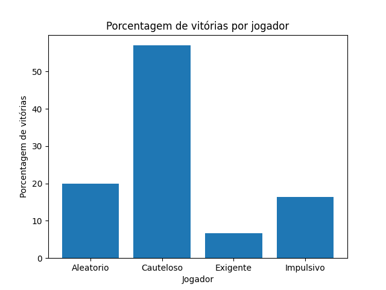
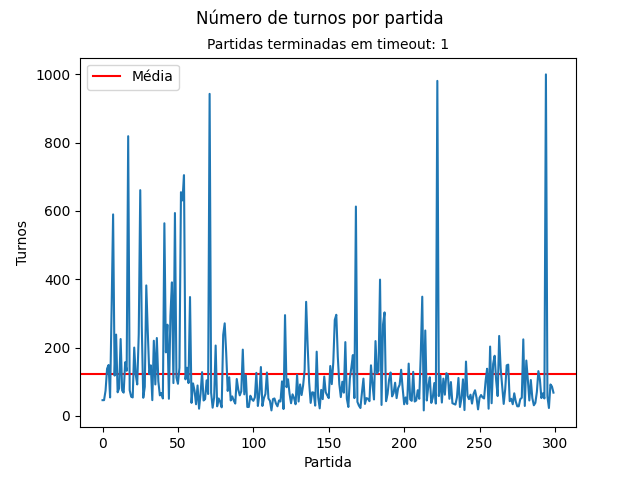

# Banco Imobiliário

### Executando a aplicação
-  Primeiro, instale as dependências.
```console
pip3 install -r requirements.txt
```

- Execute a aplicação.
```console
python3.10 main.py --salvar-graficos --imprimir-estatisticas
``` 

- Caso necessário, obtenha ajuda.
```console
python3.10 main.py -h
```

O resultado obtido contém a documentação dos parâmetros que podem ser passados para aplicação.
```console
usage: main.py [-h] [--limite-turnos LIMITE_TURNOS] [--bonus-rodada BONUS_RODADA] [--num-props NUM_PROPS] [--saldo-inicial SALDO_INICIAL]
               [--num-partidas NUM_PARTIDAS] [--salvar-graficos | --no-salvar-graficos] [--imprimir-estatisticas | --no-imprimir-estatisticas]

Jogo do Banco Imobiliário

options:
  -h, --help            show this help message and exit
  --limite-turnos LIMITE_TURNOS
                        Número limite de turnos por partida
  --bonus-rodada BONUS_RODADA
                        Valor do bônus por rodada para cada jogador
  --num-props NUM_PROPS
                        Número de propriedades no tabuleiro
  --saldo-inicial SALDO_INICIAL
                        Saldo de cada jogador no início da partida
  --num-partidas NUM_PARTIDAS
                        Número de partidas a serem simuladas
  --salvar-graficos, --no-salvar-graficos
                        Salva o gráfico da partida (default: False)
  --imprimir-estatisticas, --no-imprimir-estatisticas
                        Imprime as estatísticas da partida (default: False)
```

### Resultados
- Ao executar a aplicação com o comando 
```console
python3.10 main.py --salvar-graficos --imprimir-estatisticas
``` 

Obtem-se:
```console
Média de turnos por partida: 122.04
Partidas terminadas em timeout: 1
Jogador com mais vitórias: Cauteloso
Porcentagem de vitórias por jogador:
 - Aleatorio: 20.00%
 - Cauteloso: 57.00%
 - Exigente: 6.67%
 - Impulsivo: 16.33%
```

Além disso, é gerada uma visuazação dos resultados obtidos a partir das simulações. As imagens ficam salvas no diretório ```/imagens``` e podem ser visualizadas a seguir.





### Executando os testes
- Execute o comando a seguir.
```shell
pytest
```